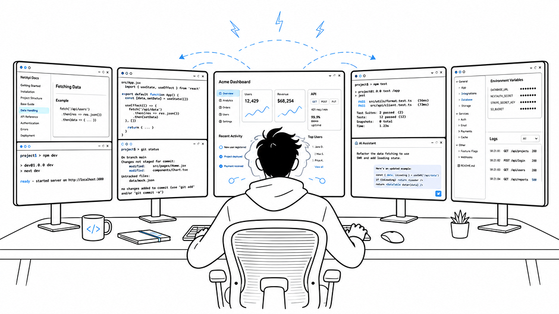

**Vibe coding** hands the implementation over to AI agents. The developer describes what they want, and the agent explores the project, edits files, and iterates on the result. This changes what programming asks of a developer: less sustained attention on writing code, more directing and orchestrating agents.

We were curious what this shift means for **ADHD software developers.** Their traits often became difficulties in conventional programming, where progress depended on staying with one task from start to finish. We asked whether the same traits look different once agents carry out the implementation.

To find out, we ran a **3-day diary study with ADHD software developers.** Participants rediscovered traits that had been constrained as strengths. Generating many alternatives became a way to prototype and compare. Drifting between tasks became orchestrating several agent sessions at once. Interest-driven focus, no longer slowed by repetitive implementation, carried ideas through to completion.

At the same time, vibe coding brought new tensions. Managing a much broader context, and stopping before exhaustion when nothing in the tool signaled an end, fell entirely on the developers. From these tensions, participants articulated a value of their own: **steadiness,** making progress when focus is low and stopping before excessive focus takes over.

Based on these findings, we propose design implications for vibe coding tools: preserving branches of exploration, coordinating agent work around the developer's attention, and restoring the conditions for stopping and resuming.

This project is work in progress.
