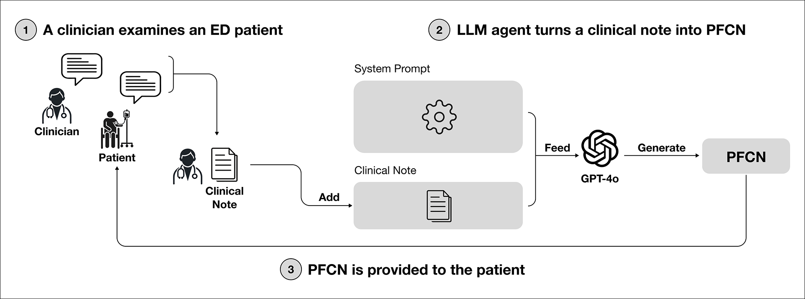

**Emergency department care** leaves little time for patients to understand what is happening or to ask questions. This paper asks whether large language models can help by turning clinicians’ notes into **patient-friendly clinical notes (PFCNs)** during ED consultations. We first interviewed patients and clinicians to understand what these notes should contain, then built a GPT-4o-based system that generates plain-language documents for initial visits, follow-ups, and discharge. We evaluated 120 PFCNs with 10 clinicians and 20 patients through simulated ED consultations.

The notes were rated as **highly understandable,** and patients reported significantly **higher participation** when using them. They helped patients understand their condition, prepare questions, feel reassured, and communicate more effectively with clinicians. At the same time, the study shows that hallucinations, misalignment with clinician intent, and workflow integration remain critical risks. In conclusion, this work shows that LLM-generated clinical notes can make emergency care more participatory, but only if they are designed with clinician oversight, transparent attribution, and safeguards for accuracy.

This paper was published at **[Scientific Reports 16](https://www.nature.com/srep/volumes)**.
